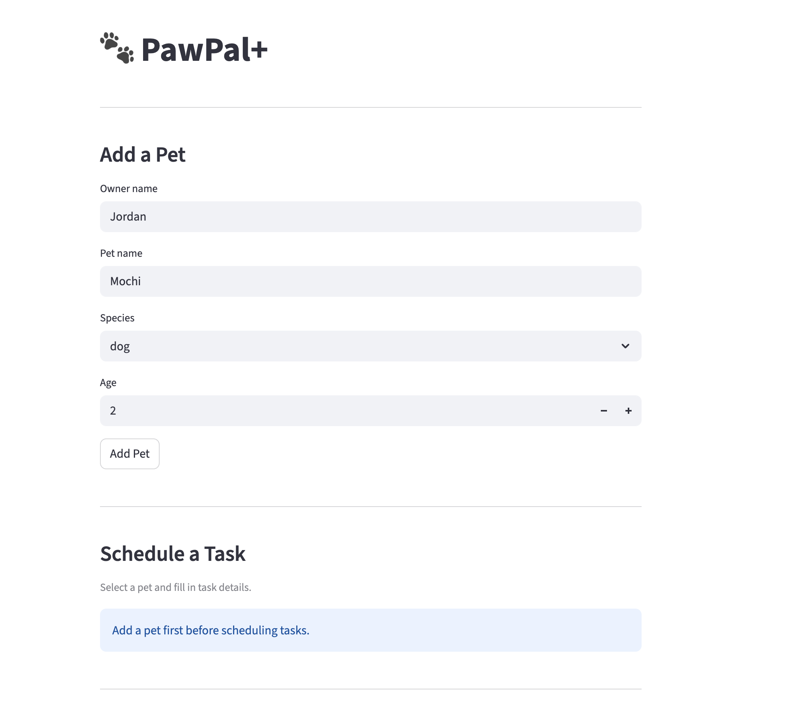

# PawPal+ (Module 2 Project)

You are building **PawPal+**, a Streamlit app that helps a pet owner plan care tasks for their pet.

## Scenario

A busy pet owner needs help staying consistent with pet care. They want an assistant that can:

- Track pet care tasks (walks, feeding, meds, enrichment, grooming, etc.)
- Consider constraints (time available, priority, owner preferences)
- Produce a daily plan and explain why it chose that plan

Your job is to design the system first (UML), then implement the logic in Python, then connect it to the Streamlit UI.

## What you will build

Your final app should:

- Let a user enter basic owner + pet info
- Let a user add/edit tasks (duration + priority at minimum)
- Generate a daily schedule/plan based on constraints and priorities
- Display the plan clearly (and ideally explain the reasoning)
- Include tests for the most important scheduling behaviors

## Features

- **Multi-pet task tracking** — an `Owner` holds multiple `Pet` objects, each with their own task list and health notes log.
- **Sorting by time** — tasks can be ordered ascending by `due_time` so daily schedules always display chronologically.
- **Filtering by status or pet** — query tasks by completion status, by pet name, or both at once without scanning the full list manually.
- **Conflict warnings** — the scheduler scans all pending tasks and flags two conflict levels: same-pet overlapping tasks (`CONFLICT`) and cross-pet double-booking (`WARNING`).
- **Recurring task scheduling** — completing a `DAILY` or `WEEKLY` task automatically generates the next occurrence; `ONCE` tasks are closed permanently.
- **Task deduplication** — adding a task with a duplicate description raises a `ValueError` immediately, preventing silent double-entries.
- **Owner-level task cache** — `get_all_tasks()` caches `(pet_name, Task)` pairs and invalidates automatically when pets or tasks change, avoiding redundant list traversals.
- **Daily summary** — a formatted, per-pet view of all pending tasks sorted by time, including category and recurrence frequency.

## Smart Scheduling

The `Scheduler` class includes several algorithmic features beyond basic task tracking:

**Sorting** — `sort_by_time(tasks)` returns any list of `Task` objects ordered by `due_time` ascending. Used internally by `daily_summary()` and available for custom views.

**Filtering** — `filter_tasks(completed, pet_name)` lets you query tasks by completion status, pet, or both. Pass `completed=False` for pending only, `completed=True` for history, or omit either argument to skip that filter.

**Conflict detection** — `get_conflicts()` scans all pending tasks and returns a list of warning strings. Two levels are reported:
- `CONFLICT` — same pet has two or more tasks at the same time
- `WARNING` — different pets have tasks at the same time (owner is double-booked)

No exceptions are raised; an empty list means no conflicts.

**Recurring task scheduling** — when a `daily` or `weekly` task is completed via `complete_task()`, the next occurrence is automatically created using `Task.next_occurrence()`, which advances `due_date` by `timedelta(days=1)` or `timedelta(weeks=1)`. Tasks marked `once` are completed permanently with no follow-up created.

## 📸 DEMO ##




## Testing PawPal+

```bash
python -m pytest tests/test_pawpal.py -v
```
42 passed in 0.01s
Tests cover creating and completing tasks, sorting by time, filtering by pet and status, and recurring task scheduling (daily/weekly/once). Conflict detection is verified for same-pet overlaps and cross-pet double-booking. Edge cases include empty task lists, unknown pet names, and cache consistency after adding or completing tasks.

Confidence Level 4

## Getting started

### Setup

```bash
python -m venv .venv
source .venv/bin/activate  # Windows: .venv\Scripts\activate
pip install -r requirements.txt
```

### Suggested workflow

1. Read the scenario carefully and identify requirements and edge cases.
2. Draft a UML diagram (classes, attributes, methods, relationships).
3. Convert UML into Python class stubs (no logic yet).
4. Implement scheduling logic in small increments.
5. Add tests to verify key behaviors.
6. Connect your logic to the Streamlit UI in `app.py`.
7. Refine UML so it matches what you actually built.
