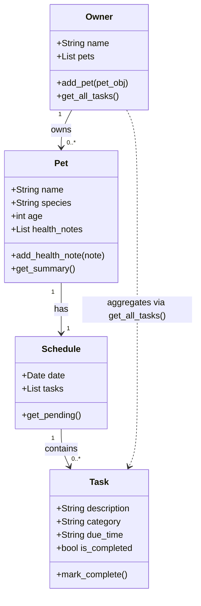

# PawPal+ Class Diagram

## Classes

### Owner
- **name** (str): The owner's name.
- **pets** (list): A collection of Pet objects.
- `add_pet(pet_obj)`: Registers a new pet to the owner's profile.
- `get_all_tasks()`: Aggregates tasks from all pets for a master schedule view.

### Pet
- **name** (str): The pet's name.
- **species** (str): Breed or species (e.g., Dog, Cat).
- **age** (int): The pet's age.
- **health_notes** (list): A log of medical history or physical observations.
- `add_health_note(note)`: Appends a timestamped string to the health log.
- `get_summary()`: Returns a quick-glance string of the pet's vital info.

### Task
- **description** (str): The name of the activity (e.g., "Morning Feeding").
- **category** (str): Type of task (Feeding, Medication, Exercise, Appointment).
- **due_time** (str): The scheduled time for the task.
- **is_completed** (bool): Tracks whether the task has been performed.
- `mark_complete()`: Toggles the completion status to True.

### Schedule
- **date** (date): The calendar day this schedule represents.
- **tasks** (list): A list of Task objects.
- `get_pending()`: Returns a list of tasks that are not yet completed.

---

## Mermaid Class Diagram

