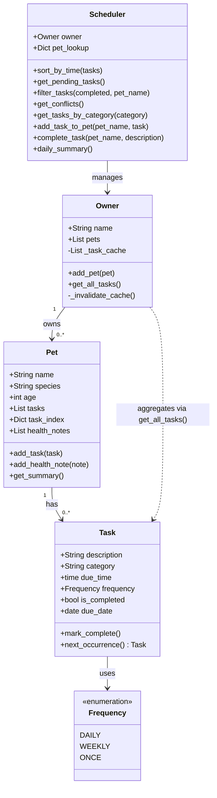

# PawPal+ Class Diagram

## Classes

### Frequency (Enum)
- `DAILY`: Task recurs every day.
- `WEEKLY`: Task recurs every week.
- `ONCE`: Task occurs one time only.

### Task
- **description** (str): The name of the activity (e.g., "Morning Feeding").
- **category** (str): Type of task (e.g., feeding, medication, exercise).
- **due_time** (time): The scheduled time for the task.
- **frequency** (Frequency): How often the task recurs.
- **is_completed** (bool): Tracks whether the task has been performed.
- **due_date** (date): The calendar date the task is due.
- `mark_complete()`: Marks the task as completed.
- `next_occurrence()`: Returns a new Task for the next recurrence, or None if ONCE.

### Pet
- **name** (str): The pet's name.
- **species** (str): Breed or species (e.g., Dog, Cat).
- **age** (int): The pet's age.
- **tasks** (list): Task objects belonging to this pet.
- **task_index** (dict): Lowercase description → Task lookup for fast access.
- **health_notes** (list): A log of medical history or physical observations.
- `add_task(task)`: Adds a task, raising ValueError if a duplicate description exists.
- `add_health_note(note)`: Appends a timestamped string to the health log.
- `get_summary()`: Returns a quick-glance string of the pet's vital info.

### Owner
- **name** (str): The owner's name.
- **pets** (list): A collection of Pet objects.
- **_task_cache** (list): Private cache of (pet_name, Task) pairs for performance.
- `add_pet(pet)`: Registers a new pet and invalidates the task cache.
- `get_all_tasks()`: Returns cached (pet_name, Task) pairs across all pets.
- `_invalidate_cache()`: Clears the task cache when pets or tasks change.

### Scheduler
- **owner** (Owner): The owner whose pets and tasks are being managed.
- **pet_lookup** (dict): Lowercase pet name → Pet lookup for fast access.
- `sort_by_time(tasks)`: Returns tasks sorted ascending by due_time.
- `get_pending_tasks()`: Returns all incomplete (pet_name, Task) pairs sorted by time.
- `filter_tasks(completed, pet_name)`: Filters tasks by completion status and/or pet name.
- `get_conflicts()`: Returns warning strings for same-time scheduling conflicts.
- `get_tasks_by_category(category)`: Filters all tasks by category (case-insensitive).
- `add_task_to_pet(pet_name, task)`: Adds a task to a pet by name.
- `complete_task(pet_name, description)`: Marks a task complete and schedules the next occurrence if recurring.
- `daily_summary()`: Returns a formatted summary of pending tasks grouped by pet.

---

## Mermaid Class Diagram

